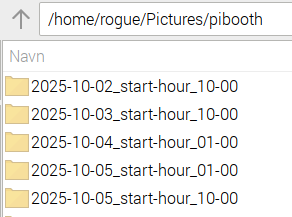

=============================
pibooth-date-folder
=============================

|PythonVersions| |PypiVersion| |Downloads|

``pibooth-date-folder`` is a plugin for the `pibooth`_ application.

It organizes photos into per-date folders with a configurable
split time, supporting multiple quoted base directories.

.. contents::
   :local:

Requirements
------------
- Python 3.6+
- PiBooth 2.0.8 or later

IMPORTANT — Date/Time must be set correct before using this plugin
------------------------------------------------------------------
This plugin relies on the system date and time to determine when new folders should be created.  
You must ensure that the device has a **correct system clock** before running PiBooth. This can be achieved by one of the following:

- **Internet access** for NTP time synchronization  
- **A hardware RTC module** (e.g., DS3231)  
- **Manually setting the system time** prior to launching PiBooth

If the system time is incorrect, the plugin may create folders under the wrong date or switch at unexpected times.

Installation
------------
Run::

    pip install pibooth-date-folder

PiBooth will auto-discover the plugin—**no edits** to your `pibooth.cfg` are needed.

Configuration
-------------
On first launch, this plugin adds a `[DATE_FOLDER]` section to your
`~/.config/pibooth/pibooth.cfg`::

    [DATE_FOLDER]
    # Hour when a new date-folder starts (0–23, default: 10)
    start_hour = 10
    # Minute when a new date-folder starts (00–59, default: 00)
    start_minute = 00
    # Mode for how folder switching is handled: strict (default) or force_today
    on_change_mode = strict

Adjust these values in PiBooth’s Settings menu (ESC → Settings) at any time.
Changes take effect at the start of the next photo session.

Setup in Pibooth Menu
---------------------

**Explanation of options:**

- **start_hour / start_minute**  
  Define the daily time when a new folder should start. Useful if your events run past midnight but should count as the same “day” (e.g. starting a new folder at 10:00 the next day).

- **on_change_mode**  
  - ``strict`` *(default)* — The folder switches exactly at the configured time every day, even if no sessions have occurred yet.
  - ``force_today`` — The folder always matches the current calendar date, ignoring the configured time.

Usage
-----
1. **Snapshot original bases**  
   On configure, the plugin reads your existing quoted
   `directory` setting under `[GENERAL]` (one or more paths) and caches them.

2. **Per-session logic** (`state_wait_enter`)  
   - Builds a “threshold” datetime from `start_hour:start_minute`.  
   - If you **changed** the threshold since the last session, it treats the next folder as **today**.  
   - Otherwise, if the current time is **before** the threshold, it treats it as **yesterday**, else **today**.  
   - Creates a subfolder named::

        YYYY-MM-DD_start-hour_HH-MM

   - under each of your original base directories.  
   - Overrides PiBooth’s in-memory `directory` to the quoted list of these new folders, writing into **all** of them.

Testing the Threshold
---------------------
To simulate a day-boundary without waiting 24 hours:

1. In PiBooth’s Settings menu, set `start_hour`/`start_minute` to a time a few minutes **ahead** of now (e.g., it’s 13:58; set to 14:00).  
2. Close the menu and take a photo session. Because it’s the **first** session after changing the threshold, the plugin treats it as **today**, creating a folder for today’s date.  
3. Take another session **before** the threshold time; since you didn’t change the threshold again, the plugin applies “before threshold → yesterday,” creating a folder for the **prior** date.  
4. Take one more session **after** the threshold; it creates a folder for **today** again.

This lets you verify both “yesterday” and “today” folder behavior within minutes.

Examples
--------
Given in your config::

    [GENERAL]
    directory = "~/Pictures/pibooth", "~/Pictures/backup_booth"

- **Before** threshold (10:00, time 09:30):  
  Photos saved in::

      "~/Pictures/pibooth/2025-07-11_start-hour_10-00", "~/Pictures/backup_booth/2025-07-11_start-hour_10-00"

- **After** threshold (time >10:00):  
  Photos saved in::

      "~/Pictures/pibooth/2025-07-12_start-hour_10-00", "~/Pictures/backup_booth/2025-07-12_start-hour_10-00"

Changelog
---------
- v1.5.6

  🎉 Initial release of the pibooth-date-folder plugin.

  - Automatically organizes photos into date-based folders  
  - Configurable daily switch time  
  - Works with multiple base directories

- latest updates

  - In-memory override of `GENERAL/directory`
  - Added ``on_change_mode`` (``strict`` default / ``force_today`` override).
  - Keeps multiple quoted base paths and `~` prefix; writes to all.
  - Switched hour range to 0–23 (UI/docs) for clarity.
  - Legacy value 24 is treated as 00 (midnight) internally.
  - Clamps minutes to 0–59 for robustness.

License
-------
GPL-3.0-or-later

Links
-----
`pibooth`_ 

.. --- Links ------------------------------------------------------------------

.. _`pibooth`: https://pypi.org/project/pibooth

.. |PythonVersions| image:: https://img.shields.io/pypi/pyversions/pibooth-date-folder.svg
   :target: https://pypi.org/project/pibooth-date-folder
.. |PypiVersion| image:: https://img.shields.io/pypi/v/pibooth-date-folder.svg
   :target: https://pypi.org/project/pibooth-date-folder
.. |Downloads| image:: https://img.shields.io/pypi/dm/pibooth-date-folder.svg
   :target: https://pypi.org/project/pibooth-date-folder

